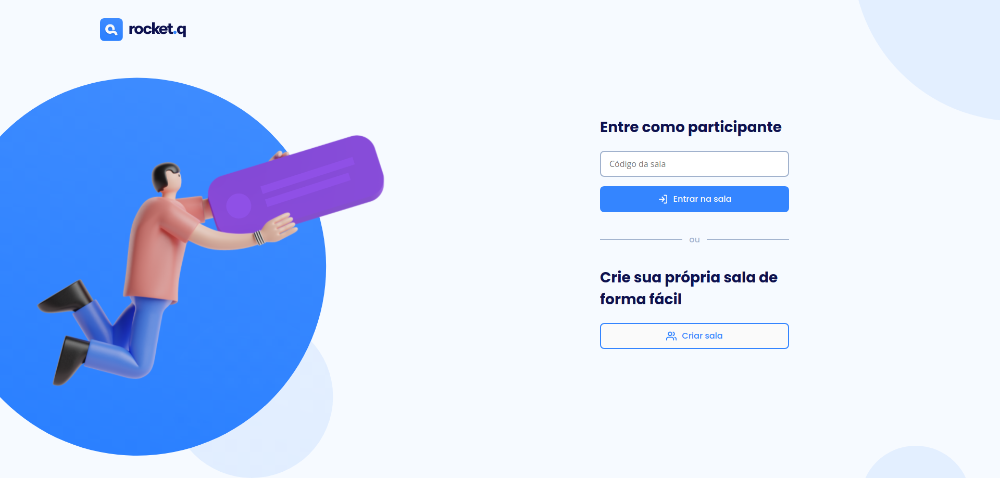

# Rocket.Q

  

## Sobre

Rocket.Q é uma aplicação de interação através de perguntas, sendo possível criar uma sala para internautas anônimos fazerem perguntas e o criador da sala em posse de uma senha gerenciar essas perguntas e marcar como lidas.

## Como executar

- Clone o repositório.
- Rode `yarn` para baixar as dependências.
- Rode `yarn db` para criar as tabelas do banco de dados.
- Rode `yarn start` para iniciar a aplicação.

A aplicação estará disponível em `http://localhost:8080/`

## Tecnologias

Para o desenvolvimento deste projeto foram utilizadas as seguintes tecnologias:

- HTML
- CSS
- JavaScript
- Node.js
- EJS
- Express
- SQLite

---
Desenvolvido com 💙 por [Lucas Rangel](https://www.linkedin.com/in/lucasrngl/)